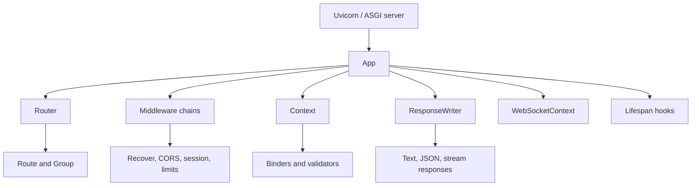

# Lettia

Lettia is a small, explicit ASGI framework for Python 3.12+. It provides the
core building blocks for HTTP APIs and real-time endpoints while keeping the
application model close to native ASGI:

- method-aware routing with static, parameter, wildcard, and named routes;
- lazy request parsing through `Context`;
- composable pre-routing, global, route, and group middleware;
- text, JSON, bytes, streaming, cookie, and header responses;
- explicit WebSocket and application-lifespan handling;
- typed binding and validation through small extension protocols; and
- synchronous and asynchronous testing through HTTPX ASGI transport.

Lettia is designed as an ASGI application kernel. It does not impose a
database layer, dependency-injection container, template engine, configuration
system, or background-job queue.

## Quick start

### Install

```bash
uv add lettia uvicorn
```

For development:

```bash
uv add --dev pytest pytest-asyncio pytest-cov ruff pyright
```

The runtime dependency is `attrs`. Optional extras are available for Pydantic,
msgspec-related integrations, and HTTPX-based testing:

```bash
uv add "lettia[pydantic]"
uv add "lettia[testing]"
```

### Create an application

```python
# app.py
from lettia import App, Context

app = App()


@app.get("/health")
def health(ctx: Context) -> dict[str, str]:
    return {"status": "ok"}


@app.get("/users/:user_id")
def get_user(ctx: Context) -> dict[str, str]:
    return {"id": ctx.path_params["user_id"]}
```

Run it with Uvicorn:

```bash
uv run uvicorn app:app --reload
```

Then open `http://127.0.0.1:8000/health` or
`http://127.0.0.1:8000/users/42`.

## Architecture at a glance

Lettia is organized around a small set of explicit layers:



| Layer | Main components | Responsibility |
|---|---|---|
| ASGI core | `App`, `Router`, `Context`, `Response` | Request dispatch and protocol boundaries |
| Composition | `Route`, `Group`, middleware | Organize routes and cross-cutting behavior |
| Extensions | binders, validators, renderers, `StaticFiles` | Add capabilities without enlarging the core |
| Developer tooling | `TestClient`, pytest, benchmarks, docs | Verify behavior, performance, and public contracts |

The public entry points are re-exported from `lettia`, while optional or
specialized capabilities live under `lettia.protocols`, `lettia.ext`, and
`lettia.testing`.

## HTTP request lifecycle

An HTTP request follows this pipeline:

```mermaid
flowchart LR
    A["ASGI scope"] --> B["Create Context"]
    B --> C["Pre-routing middleware"]
    C --> D["Global middleware"]
    D --> E["Router.match"]
    E --> F["Route / group middleware"]
    F --> G["Sync or async handler"]
    G --> H["normalize_response"]
    H --> I["ResponseWriter"]
    I --> J["Queued background tasks"]
```



`Context` is created before routing so `app.use_pre()` middleware can inspect
or normalize `ctx.path`. Global middleware wraps dispatch and can therefore
handle unmatched paths, 404/405 responses, and CORS preflight requests. Route
and group middleware run only after a route is selected.

The order passed to `app.use()` is the outside-in order:

```python
app.use(first, second)
```

```text
first before
  second before
    route handler
  second after
first after
```

Routes and middleware chains are compiled before normal request execution,
keeping registration and composition work out of the hot path.

## Routing

| Pattern | Meaning |
|---|---|
| `/health` | Exact static route |
| `/users/:user_id` | One dynamic path segment |
| `/files/*filepath` | Remainder of the path |

Static routes use direct lookup. Parameterized and wildcard routes use a radix
tree, with matching precedence of static, parameter, then wildcard routes.
The router also provides 404 responses for unknown paths, 405 responses with an
`Allow` header for unsupported methods, automatic `HEAD` fallback to `GET`,
named reverse URL generation, and URL encoding for parameter values.

```python
@app.get("/users/:user_id", name="user_detail")
def user_detail(ctx: Context) -> dict[str, str]:
    return {"id": ctx.path_params["user_id"]}


url = app.url_for("user_detail", user_id="a user")
# "/users/a%20user"
```

Groups compose prefixes and middleware:

```python
api = app.group("/api/v1", auth_middleware)
users = api.group("/users")


@users.get("/:user_id")
def get_user_detail(ctx: Context) -> dict[str, str]:
    return {"id": ctx.path_params["user_id"]}
```

See [Routing](docs/routing.md) for precedence, groups, and reverse URLs.

## Context, binding, and state

`Context` is the request-local interface exposed to HTTP handlers. Query
parameters, headers, cookies, and the body are parsed lazily and cached:

```python
@app.post("/echo")
async def echo(ctx: Context) -> dict[str, object]:
    return {"received": await ctx.json()}
```

It also provides `ctx.path_params`, `ctx.state`, `ctx.bind(TargetType)`,
`ctx.abort(status_code, detail)`, and `ctx.add_background_task()`.

Built-in binders support `attrs` classes, standard-library dataclasses, and
Pydantic v2 models when the optional dependency is installed:

```python
from attrs import define


@define(slots=True)
class CreateUser:
    name: str
    age: int = 18


@app.post("/users")
async def create_user(ctx: Context) -> dict[str, object]:
    user = await ctx.bind(CreateUser)
    return {"name": user.name, "age": user.age}
```

Use `app.state` for application-wide resources such as a connection pool, and
`ctx.state` for values belonging to one request.

## Responses and errors

Handlers may return a `Response`, `str`, `bytes`, `dict`, `list`, or a tuple of
`(body, status_code[, headers])`. Lettia normalizes these values before
`ResponseWriter` emits ASGI response messages. Available response types include
`TextResponse`, `JsonResponse`, and `StreamResponse`.

Expected HTTP failures use `ctx.abort()` or `abort()`:

```python
def require_admin(ctx: Context) -> None:
    if ctx.header("x-role") != "admin":
        ctx.abort(403, "Administrator access required")
```

The default error handler renders dictionary/list details as JSON and other
details as text. Use `recover()` or `@app.error_handler` to customize
unexpected-error handling.

## Middleware and built-in capabilities

Register global middleware with `app.use()` and middleware that must run before
routing with `app.use_pre()`:

```python
from lettia.middleware import (
    body_limit,
    cors,
    recover,
    request_id,
    request_logger,
)

app.use(
    recover(),
    request_logger(),
    cors(allow_origins=["https://frontend.example"]),
    request_id(),
    body_limit(max_bytes=1024 * 1024),
)
```

Built-in middleware includes:

| Middleware | Purpose |
|---|---|
| `recover()` | Convert unexpected exceptions into HTTP 500 responses |
| `request_logger()` | Log method, path, status, and duration |
| `cors()` | Add CORS headers and answer preflight requests |
| `request_id()` | Propagate or generate `X-Request-ID` |
| `timeout()` | Enforce a request deadline |
| `body_limit()` | Enforce a request body limit |
| `rate_limit()` | In-memory sliding-window rate limiting |
| `session()` | Signed JSON cookie sessions |

Signed sessions provide integrity, not encryption. Store identifiers or
non-sensitive preferences, not passwords or secrets.

## WebSockets and lifespan

WebSocket and HTTP requests are separate ASGI branches. WebSocket handlers use
`WebSocketContext` and do not pass through the HTTP response or middleware
chain:

```python
from lettia import WebSocketContext, WebSocketDisconnect


@app.websocket("/ws")
async def echo_socket(ws: WebSocketContext) -> None:
    await ws.accept()
    try:
        while True:
            message = await ws.receive_text()
            await ws.send_text(f"Echo: {message}")
    except WebSocketDisconnect:
        return
```

Application startup and shutdown are handled through lifespan hooks:

```python
@app.on_event("startup")
async def startup() -> None:
    app.state["pool"] = await create_pool()


@app.on_event("shutdown")
async def shutdown() -> None:
    await app.state["pool"].close()
```

See [WebSockets](docs/websocket.md) and [Architecture](docs/architecture.md)
for the full protocol boundaries.

## Extensions and static files

The core intentionally keeps integrations small and replaceable:

| Package | Examples |
|---|---|
| `lettia.protocols` | Binders, validators, and renderers |
| `lettia.ext` | `StaticFiles` with ETag, ranges, streaming, and traversal protection |
| `lettia.testing` | Synchronous `TestClient` over `httpx.ASGITransport` |

Static files are mounted as a wildcard route:

```python
from lettia.ext import StaticFiles

static = StaticFiles("public", html=True)
app.add_route("GET", "/*filepath", static.handle)
```

## Testing and quality checks

For concise synchronous tests:

```python
from lettia.testing import TestClient


def test_health() -> None:
    response = TestClient(app).get("/health")
    assert response.status_code == 200
    assert response.json() == {"status": "ok"}
```

For async tests, use HTTPX directly with `ASGITransport`. The repository uses
pytest with an 80% source-coverage gate, Ruff for linting, and Pyright for
static type checking:

```bash
uv run pytest
uv run ruff check .
uv run pyright
```

The benchmark suite measures routing, context allocation, middleware chains,
typed binding, the full ASGI pipeline, session/rate-limit primitives, and
response normalization:

```bash
uv run python benchmarks/run_benchmark.py
```

Benchmark results are useful for local regression tracking, not a portable
performance guarantee across machines or deployment environments.

## Documentation map

- [Getting started](docs/getting_started.md) — build a JSON API from scratch.
- [Architecture](docs/architecture.md) — runtime layers and lifecycle.
- [Routing](docs/routing.md) — routes, groups, precedence, and reverse URLs.
- [Context and binding](docs/context_and_binding.md) — input, state, models, and responses.
- [Middleware](docs/middleware.md) — ordering and built-in middleware.
- [WebSockets](docs/websocket.md) — connection lifecycle and frame helpers.
- [Static files](docs/static_files.md) — safe file serving and range requests.
- [Testing](docs/testing.md) — synchronous/async tests and quality gates.
- [API reference](docs/api_reference.md) — public signatures and entry points.

## Project structure

```text
src/lettia/
├── app.py                 # ASGI entrypoint, routing, middleware, lifespan
├── context.py             # Request data, state, body parsing, binding
├── router.py              # Static and radix-tree route matching
├── response.py            # Response types and ASGI response writer
├── websocket.py           # WebSocket context and state transitions
├── middleware/            # Composable built-in middleware
├── protocols/             # Binder, validator, and renderer protocols
├── ext/                   # Optional extensions such as StaticFiles
└── testing.py             # HTTPX-based test client

tests/                     # Behavioral and regression tests
examples/                  # REST API and static-site examples
benchmarks/                # Local performance benchmarks
docs/                      # User and API documentation
```

## Design principles

1. Keep the ASGI boundary visible.
2. Compile route and middleware composition before the hot path.
3. Parse request data lazily and cache it per request.
4. Normalize simple handler return values into one response model.
5. Keep integrations composable instead of forcing a full-stack architecture.
6. Test public behavior and edge conditions, not only implementation details.

## License

Lettia is released under the [MIT License](LICENSE).
