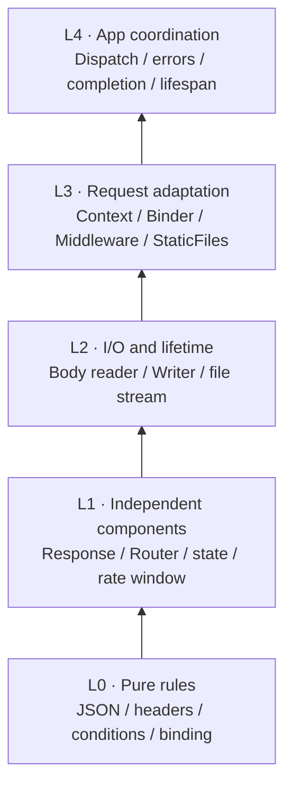
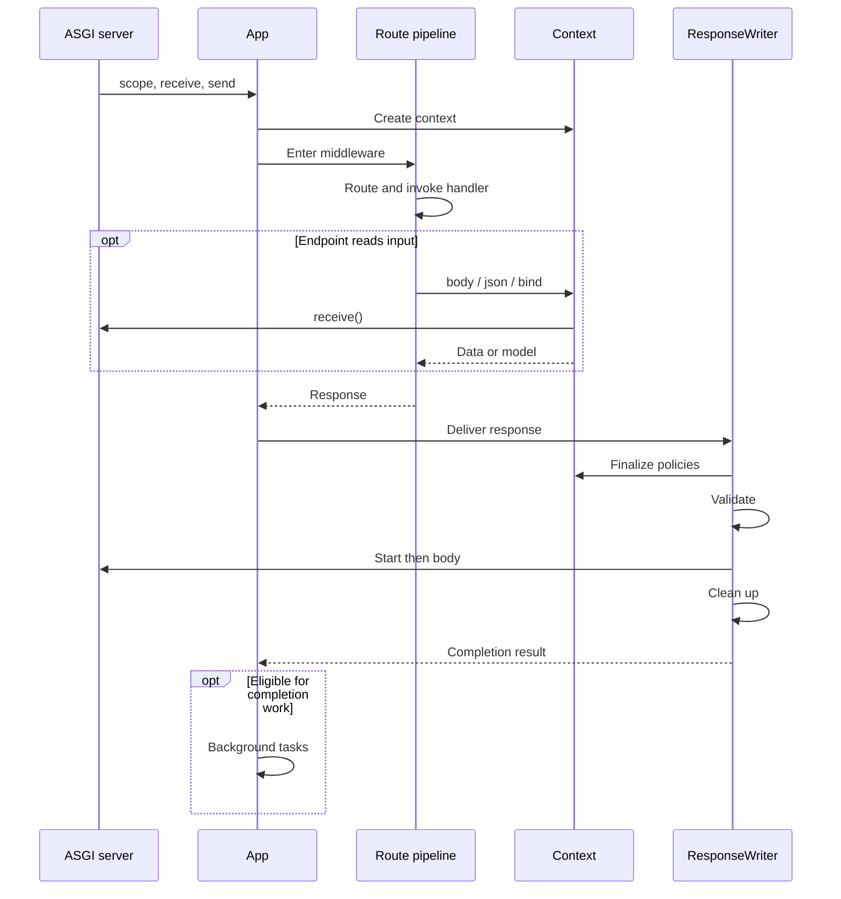
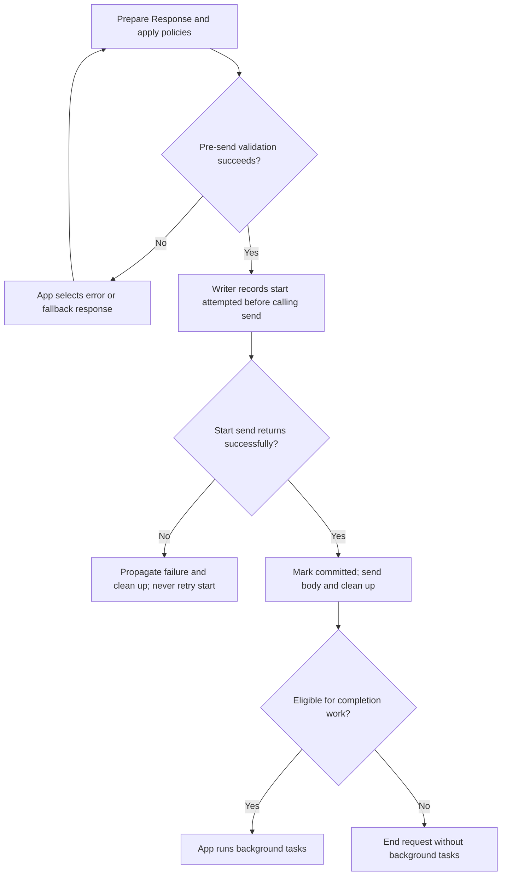

# Architecture

Lettia is an ASGI application with a small set of explicit layers. The
framework moves route and middleware assembly out of the hot path while
keeping request data and response behavior visible to the handler.

This advanced page explains component ownership and the HTTP, WebSocket and
lifespan branches for debugging and framework contributions. To build an
application, start with [Getting started](getting_started.md) and the task
guides; use the [API reference](api_reference.md) for public contracts.

## Components

| Component | Responsibility |
|---|---|
| `App` | ASGI entrypoint, route registration, middleware, lifespan, and error handling |
| `Router` | Static, parameterized, wildcard, named, and method-aware matching |
| `Context` | Request data, path parameters, per-request state, binding, and aborts |
| `Response` | In-memory or streaming response representation |
| `ResponseWriter` | Converts a `Response` into ASGI response messages |
| `WebSocketContext` | WebSocket state transitions and frame helpers |

The package deliberately does not impose a database, dependency injection
container, template engine, application configuration system, or distributed
job/limit service.

## Responsibility layers

| Layer | Owners | Boundary |
|---|---|---|
| L0: pure rules | `_json`, `_headers`, `_conditional`, `_binding` | Values in, validated values or narrow exceptions out; no request or file I/O |
| L1: independent components | Response, Router, StateStore, rate window | Own representation and local invariants |
| L2: I/O and lifetime | Context body reader, ResponseWriter, static file stream | Own channels, resource cleanup, deadlines and cancellation |
| L3: request adapters | Context, Binder, Middleware, StaticFiles | Read request data, apply policy, translate rule results to HTTP responses |
| L4: application coordination | App | Dispatch, choose error replacements, run completion work and lifespan |

These are responsibilities, not a requirement for five inheritance hierarchies
or directories. Context spans request adaptation and body ownership; StaticFiles
keeps path security, metadata, content hashing and file delivery together.
Router and WebSocket behavior remain in their existing components.

The arrows show the bottom-up responsibility model, not an import graph or a
requirement to call every intermediate layer. The table above maps each owner
to its responsibilities.



Response and WebSocket JSON validation share `_json`; neither imports Context
for that rule. `lettia.context.validate_json_value` remains a compatibility
entry point. Response mutations and final Writer encoding share `_headers`.
StaticFiles passes values to `_conditional` after resolving and checking the
file. Binders use `_binding` to analyze constructor fields and coerce scalars;
the request adapter owns JSON/query precedence and HTTP 400 translation.

### Writer and policy ownership

App enables Context's deferred policy registry through an internal method.
Middleware registers callbacks; standalone middleware applies them immediately.
Writer finalizes a fresh header copy before validation, so reused responses do
not accumulate cookies. Context runs callbacks in registration order, removes
failed policies, and continues remaining policies before reporting the first
failure. Session callbacks read the latest request state.

Writer's private delivery entry accepts a response, deadline, finalizer and
optional disconnect callback. It returns completion eligibility; exceptions
and cancellation still propagate. The public `write()` keeps its `None` return
and does not attach a request receiver. Both entries share one write lock.

Only Writer owns attempted start, committed start, body completion and cleanup
state. App checks a read-only replacement query before constructing an error
response and uses the delivery result to gate background work. It never edits
transport flags. Context continues to own receive, body cache and rejection;
Writer receives only a disconnect callback, not Context or an ASGI receiver.

See the [contract migration audit](testing_audit.md) for the transition table,
test mapping and validation evidence.

## HTTP request lifecycle



This diagram shows the normal HTTP path. Routing failures and short-circuiting
middleware can return a response without invoking an endpoint. Streamed bodies
are consumed by Writer after the middleware chain has returned.
The route pipeline comprises pre-routing middleware, global middleware, route
matching, route/group middleware and the endpoint. Endpoint results are
normalized before returning through the chain. App passes Writer the response,
deadline and policy/disconnect callbacks; finalization uses a fresh header copy.

The `Context` exists before pre-routing middleware so a middleware can inspect
or normalize `ctx.path`. Global middleware wraps dispatch and therefore can
handle unmatched paths and CORS preflight requests. Route middleware runs only
after a route has been selected.

### Middleware nesting

The order passed to `app.use()` is the outside-in order:

```python
app.use(first, second)
```

The effective call sequence is:

```text
first before
  second before
    route handler
  second after
first after
```

`app.use_pre()` follows the same nesting rule but surrounds the global chain
and runs before route matching.

### Resource and state ownership

| Owner | Owns | Collaborates through |
|---|---|---|
| Context | Request receive channel, partial/complete body cache, limits, rejection and request state | Managed body APIs; a disconnect callback supplied to Writer |
| Response | Status, header dictionary, bytes or async body source | Response mutation methods and normalization |
| Writer | Send attempts, commitment, serialized writes, body completion, iterator cleanup and disconnect coordination | Public `write()`; a private delivery result and read-only replacement query for App |
| App | Dispatch, error response selection, completion work and lifespan hooks | Component results and methods, never Writer state assignments |

Public `ctx.receive` and `ctx.send` are raw ASGI callables. Application code using
managed responses should let Context read the request and Writer send the
response; direct channel use bypasses those lifecycle guarantees. See the
[Context body contract](api/context.md#body-api) and
[Writer API](api/response.md#responsewriter).

### Error replacement boundary



Replacement is bounded: App tries the error response and then a basic fallback;
failure of the fallback propagates. A failing policy is removed before the
replacement attempt. Once response start is attempted, App cannot replace the
response even when `send()` fails before returning. `committed` specifically
means that the start send returned successfully, not merely that it was tried.

Successful normal, error and fallback responses can run background work after
cleanup. Observed disconnects, cancellation, transport failures, propagated
source errors and cleanup failures prevent it. Framework stream deadlines may
finish an already-started response cleanly; unrelated upstream `TimeoutError`
continues to propagate. See [response deadlines](api/response.md#responsewriter)
and the [completion regression coverage](testing_audit.md).

## Return values and errors

Handlers may return a `Response`, `str`, `bytes`, `dict`, `list`, or a tuple of
`(body, status_code[, headers])`. `normalize_response()` converts these values
into a response object before writing.

Use `ctx.abort()` or `abort()` for expected HTTP failures:

```python
from lettia import Context


def require_admin(ctx: Context) -> None:
    if ctx.header("x-role") != "admin":
        ctx.abort(403, "Administrator access required")
```

The default handler returns dictionary/list details as JSON and other details
as text. A custom handler can be registered with `@app.error_handler`. The
application error handler is the shared HTTP error renderer. Each compiled
handler/middleware boundary converts downstream exceptions to responses so
outer middleware can preserve CORS, request IDs, and logging. App logs unexpected
exceptions once; cancellation continues to propagate. Standalone middleware
composition still propagates exceptions.

Method-aware routing returns 404 when a path is unknown and 405 with an
`Allow` header when the path exists for another method. `HEAD` falls back to a
matching `GET` route and suppresses the response body.

## Lifespan and explicit dependencies

Startup and shutdown hooks are registered with `on_event()`. Lettia does not
hold application dependencies. Build an application with a services object and
pass it explicitly to route registration:

```python
def create_app(services: Services) -> App:
    app = App()

    @app.on_event("startup")
    async def startup() -> None:
        await services.start()

    @app.on_event("shutdown")
    async def shutdown() -> None:
        await services.close()

    register_routes(app, services)
    return app
```

This keeps the dependency direction from the composition root to routes and
services. `App` has no mutable application-state bag, so imports do not need to
reach back into a global application object. Keep request-specific values in
typed `ctx.state` keys; keep connection-specific values in `ws.state`.

## WebSocket and HTTP boundaries

WebSocket scopes use `WebSocketContext` and do not pass through the HTTP
middleware chain. Register them with `@app.websocket()` and follow the
WebSocket lifecycle in the [WebSocket guide](websocket.md).

## Deployment boundary

Deploy `App` through an ASGI server such as Uvicorn. The server and surrounding
platform should terminate TLS, define which reverse proxies are trusted, manage
workers and graceful shutdown, and export logs and telemetry. Lettia's memory
rate limiter is suitable for a single process only; use a gateway or shared
service when limits must hold across workers. Post-response tasks are
best-effort and are not a durable queue.

See [Deployment](deployment.md) for the concrete deployment checklist.

## Performance guidance

Routes and middleware chains are assembled when the app is compiled. Parsing
inside `Context` is lazy and cached. Use `benchmarks/run_benchmark.py` to
measure changes on the target Python version; the benchmark output is not a
portable performance guarantee.
