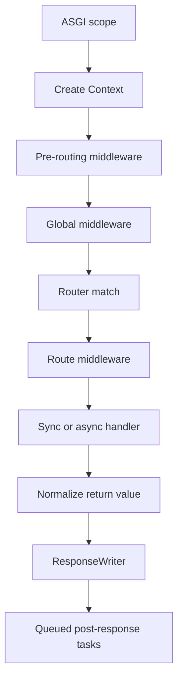

# Architecture

Lettia is an ASGI application with a small set of explicit layers. The
framework moves route and middleware assembly out of the hot path while
keeping request data and response behavior visible to the handler.

This page is the system overview. Read it before the component-specific
[API reference](api_reference.md) pages: it explains where each component sits,
which lifecycle owns it, and where the HTTP, WebSocket, and lifespan branches
separate.

## Components

| Component | Responsibility |
|---|---|
| `App` | ASGI entrypoint, route registration, middleware, lifespan, and error handling |
| `Router` | Static, parameterized, wildcard, named, and method-aware matching |
| `Context` | Request data, path parameters, per-request state, binding, and aborts |
| `Response` | In-memory or streaming response representation |
| `ResponseWriter` | Converts a `Response` into ASGI response messages |
| `WebSocketContext` | WebSocket state transitions and frame helpers |

The package deliberately does not impose a database, dependency injection
container, template engine, application configuration system, or distributed
job/limit service.

## HTTP request lifecycle



The `Context` exists before pre-routing middleware so a middleware can inspect
or normalize `ctx.path`. Global middleware wraps dispatch and therefore can
handle unmatched paths and CORS preflight requests. Route middleware runs only
after a route has been selected.

### Middleware nesting

The order passed to `app.use()` is the outside-in order:

```python
app.use(first, second)
```

The effective call sequence is:

```text
first before
  second before
    route handler
  second after
first after
```

`app.use_pre()` follows the same nesting rule but surrounds the global chain
and runs before route matching.

## Return values and errors

Handlers may return a `Response`, `str`, `bytes`, `dict`, `list`, or a tuple of
`(body, status_code[, headers])`. `normalize_response()` converts these values
into a response object before writing.

Use `ctx.abort()` or `abort()` for expected HTTP failures:

```python
from lettia import Context


def require_admin(ctx: Context) -> None:
    if ctx.header("x-role") != "admin":
        ctx.abort(403, "Administrator access required")
```

The default handler returns dictionary/list details as JSON and other details
as text. A custom handler can be registered with `@app.error_handler`. The
application error handler is the shared HTTP error renderer. Each compiled
handler/middleware boundary converts downstream exceptions to responses so
outer middleware can preserve CORS, request IDs, and logging. App logs unexpected
exceptions once; cancellation continues to propagate. Standalone middleware
composition still propagates exceptions.

Method-aware routing returns 404 when a path is unknown and 405 with an
`Allow` header when the path exists for another method. `HEAD` falls back to a
matching `GET` route and suppresses the response body.

## Lifespan and explicit dependencies

Startup and shutdown hooks are registered with `on_event()`. Lettia does not
hold application dependencies. Build an application with a services object and
pass it explicitly to route registration:

```python
def create_app(services: Services) -> App:
    app = App()

    @app.on_event("startup")
    async def startup() -> None:
        await services.start()

    @app.on_event("shutdown")
    async def shutdown() -> None:
        await services.close()

    register_routes(app, services)
    return app
```

This keeps the dependency direction from the composition root to routes and
services. `App` has no mutable application-state bag, so imports do not need to
reach back into a global application object. Keep request-specific values in
typed `ctx.state` keys; keep connection-specific values in `ws.state`.

## WebSocket and HTTP boundaries

WebSocket scopes use `WebSocketContext` and do not pass through the HTTP
middleware chain. Register them with `@app.websocket()` and follow the
WebSocket lifecycle in the [WebSocket guide](websocket.md).

## Deployment boundary

Deploy `App` through an ASGI server such as Uvicorn. The server and surrounding
platform should terminate TLS, define which reverse proxies are trusted, manage
workers and graceful shutdown, and export logs and telemetry. Lettia's memory
rate limiter is suitable for a single process only; use a gateway or shared
service when limits must hold across workers. Post-response tasks are
best-effort and are not a durable queue.

See [Deployment](deployment.md) for the concrete deployment checklist.

## Performance guidance

Routes and middleware chains are assembled when the app is compiled. Parsing
inside `Context` is lazy and cached. Use `benchmarks/run_benchmark.py` to
measure changes on the target Python version; the benchmark output is not a
portable performance guarantee.
