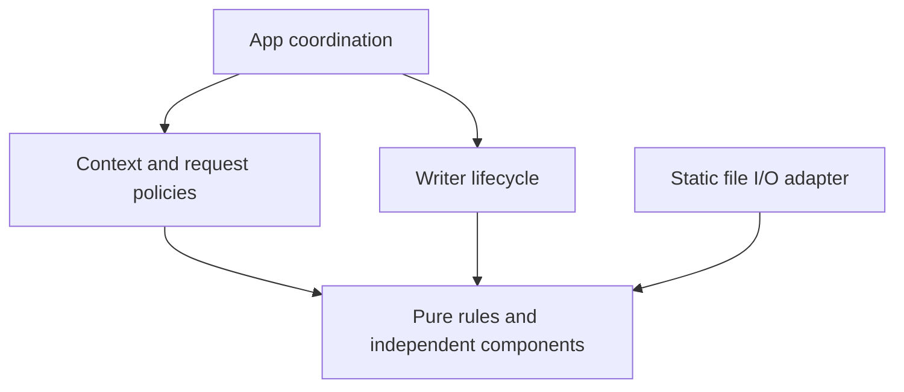

# Bottom-up migration audit

## Verification status

The sections below are dated verification snapshots, not a claim that every
later revision passed the same matrix. The implementation verified in
[Pyrefly and ty verification](#pyrefly-and-ty-verification) was committed as
`10d2d32` and pushed to `origin/main`. Its latest local Windows / Python 3.12
suite passed 622 cases with one symlink privilege skip and 95.09% coverage;
Pyrefly and ty reported zero diagnostics. The optional ty check is not a CI gate.

That run also records an intermittent Hypothesis failure whose focused and full
reruns passed without changing the test. Its cause remains unestablished.
Earlier local Windows 3.13/3.14 results belong to the preceding refactor snapshot.
After push, [CI run 37116113235](https://github.com/slime21023/lettia/actions/runs/37116113235)
passed for `10d2d32`: all six Ubuntu/Windows × Python 3.12–3.14 quality jobs and
the package validation job succeeded. This evidence applies to that commit;
verify a later release revision's own workflow run separately.

Use the [verification commands](contributing_testing.md#verification-commands) to reproduce
checks against the current checkout. Preserve historical counts below when
adding a new verification record.

## Baseline and lossless classification

On 2026-10-03, local Windows / Python 3.12.12 validation collected 544 cases
from 191 test functions. The baseline passed 543 cases, skipped one symlink
test because Windows privileges were unavailable, and reported 94.45% combined
statement/branch coverage in 16.96 seconds.

`tests/contracts.toml` is the authoritative registry of ownership, input/output,
errors, side effects and required verification layers. Test functions reference
its identifiers with `pytest.mark.contract`. Layers come from directories.

`tests/migration.json` maps each original test function to its destination and
records its original AST digest and expanded case count. During classification,
all 191 function bodies and original decorators matched their original ASTs
after removing only the newly added contract marker. All 544 collected case
names, including parameter identifiers, matched the baseline. No case or
assertion was removed in this stage.

## Ownership and transitions

| Boundary | Owner | Observable transition / invariant |
|---|---|---|
| Response preparation | Writer | Copy headers, finalize policies, validate; failure permits replacement |
| Start attempted | Writer | Set before send; further attempts prohibited even if send fails |
| Start committed | Writer | Set only when start send returns successfully |
| Streaming | Writer | One task acquires, advances and closes the iterator |
| Terminal body | Writer | Mark complete only after the final send returns |
| Cleanup | Writer | Deadline/disconnect must not cancel successful final cleanup; external cancellation waits then propagates |
| Replacement | App using Writer query | Render only while replacement remains possible; reuse the writer |
| Background completion | App using delivery result | Run once only when delivery and cleanup qualify as completed |
| Request receive/cache | Context | Body reads and disconnect monitoring share one channel owner |
| Policy registry | Context | Register in middleware order; finalize fresh responses with latest state |

Transmission and cleanup are separate phases; success cannot be inferred from
commitment alone. Framework deadline and upstream timeout classification stay
unchanged during structural refactoring.

## Layer dependency direction

The request receiver is supplied to the writer as a disconnect callback, not
as a Context dependency. Pure JSON, header, conditional-request and binding
rules must not import Context, App or the file adapter.

## Later-stage audit

Pure-rule extraction, ownership changes, deduplication decisions and real-server
results are recorded below as each stage completes. Structural changes preserve
behavior; separate failing regressions are required for behavior corrections.

### Extraction and ownership gates

The four private pure modules are `_json`, `_headers`, `_conditional` and
`_binding`. Public constructors, imports and dictionaries are unchanged.
Additional unit tests exercise these modules directly, including aliases,
InitVar, scalar/error partitions, conditional headers and container validation.
AST dependency checks constrain imports and App state access without snapshotting
entire source files. Existing Router and StateStore properties remain unchanged.

The initial independent-module/dependency tests failed in 15 cases before the
extraction and passed afterward. The full stage 3 suite passed 558 cases, skipped
one, and measured 94.58% coverage in 21.54 seconds. A naming collision introduced
by the extraction was caught by existing integration/type checks and corrected
before this gate; no changed behavior was accepted as compatibility.

The Writer collaboration tests and App state-access check failed in four cases
before moving ownership. Afterward the focused cancellation/cleanup suite passed
80 cases; the full stage 4 gate passed 562, skipped one, and measured 94.57%
coverage in 20.91 seconds. App now delegates delivery and checks replacement
eligibility; Context exposes idempotent policy activation. Public direct writes
still return `None` and share serialization with internal delivery.

### Matrix reduction audit

No function was deleted in classification or the later audit. One integration
matrix was reduced only after its full pure-rule replacement passed:

| Original test | Removed parameter cases | Replacement | Retained boundary |
|---|---|---|---|
| `tests/integration/test_static_conditions.py::test_static_unsatisfiable_range_includes_representation_size` | `bytes=0-1,3-4`, `bytes=-0`, `bytes=-`, `bytes=4-1`, each for empty and five-byte files (8 cases) | `tests/unit/test_conditional_rules.py::test_range_invalid_partitions_raise_value_error` covers all 6 original ranges × 2 sizes | Integration keeps malformed syntax and numeric unsatisfiable range × both files; asserts HTTP 416 and exact Content-Range size |

Every parsing branch raises the same `ValueError` at the adapter boundary.
The unit test preserves all error partitions; the integration cases establish
their common error-to-response translation. `tests/migration.json` keeps the
original 12-case baseline and an explicit `stage5_audit` with retained count and
replacement. No historical tracking entry is erased.

The remaining matrices were retained: HEAD/204/304 cross representation types
protects normalization and emission; ETag/method combinations protect decision
order; binding matrices protect Context reads, model selection and HTTP error
classification; policy combinations protect latest Session state and replacement
ordering. Transport/cancellation/timeout/cleanup combinations retain distinct
scheduling and resource risks. No percentage reduction was imposed.

The stage 5 gate passed 574 cases, skipped one, and measured 94.57% coverage in
24.18 seconds. Counts include collection-policy self-tests; generated Hypothesis
examples are not independent cases.

### Final inventory and local validation

The final registry contains 40 contracts. Two additional contracts distinguish
pure JSON value validation from request decoding, and Context policy ownership
from application error handling. A nesting-only unit property was corrected to
claim MW-CHAIN alone; APP-ERROR requires integration coverage. This avoids
reporting application error coverage from a test that never exercises an error.

| Layer | Test functions | Expanded cases |
|---|---:|---:|
| Unit | 109 | 218 |
| Integration | 97 | 377 |
| Smoke | 5 | 5 |
| Architecture | 8 | 19 |
| Total | 219 | 619 |

Compared with the 544-case baseline, 83 new cases verify independent rules,
ownership, collection enforcement, public signatures and real transport; eight
redundant integration parameters have the audited replacements above. All 191
original functions remain. Coverage rose from 94.45% to 95.13% without changing
the 90% gate. Counts describe collected cases; one Windows symlink case skips
only when privileges are unavailable.

On Windows / Python 3.12.12, the final full run passed 618 cases and skipped one
in 27.45 seconds with 95.13% combined statement/branch coverage. Unit selection
passed 218 cases in 4.17 seconds; the default suite includes all layers. The
five real-server tests passed on two consecutive focused runs (1.13 and 1.14
seconds), including failure-path server cleanup.

Ruff format/lint, Pyright, Pyrefly, strict public API type coverage (100%,
314/314 typable), strict Zensical build, wheel/sdist build and Twine package
validation passed locally. No new project dependency was added. The lockfile
and existing Windows/Linux × Python 3.12–3.14 CI configuration are unchanged.

Additional isolated Windows runs (without replacing the project environment):

| Python | Passed / skipped | Coverage | Suite time |
|---|---|---:|---:|
| 3.12.12 | 618 / 1 | 95.13% | 27.45 s |
| 3.13.9 | 618 / 1 | 95.13% | 36.25 s |
| 3.14.0 | 618 / 1 | 95.01% | 27.81 s |

All collect the same 619 cases. Python 3.14 reports fewer executable annotation
statements (for example ASGI typed declarations), changing the coverage
denominator; assertions and the 90% gate are identical. Timings include local
load and are not performance comparisons.

The final migration audit verified all 191 original functions remain: 190 have
identical ASTs after excluding contract markers, and the remaining function
differs only in the documented Range parametrization. Source comparison against
the initial working-directory snapshot confirms Router, ASGI path handling,
StateStore and unrelated middleware were not modified during this refactor.

**Outstanding external verification:** hosted Linux/Windows CI jobs have not
been run in this implementation session. A local Fedora WSL installation was
available but lacked pytest and pip, so it did not provide a ready Linux test
environment. Linux symlink containment and the full hosted six-job quality
matrix remain CI acceptance items; these local Windows results do not claim
that matrix has passed. No implementation item is intentionally deferred.

## Follow-up: residual code review

Call-site and dependency review found no active parallel legacy implementation.
Historical test paths in the migration manifest and the Context JSON validation
re-export remain intentional compatibility and traceability mechanisms.
Writer cancellation/cleanup guards remain covered lifecycle requirements.

A separate behavior correction narrows `Context.bind()`'s optional Pydantic
import boundary: validator `TypeError` and `ImportError` now propagate unchanged
instead of selecting the attrs fallback. The minimal direct/smart binder matrix
first produced two passes and two failures, then all four passed after the fix.
The full binding integration selection passed all 26 cases. These cases track
BIND-PYDANTIC and BIND-SCHEMA; no existing case was removed.

Structural cleanup removed a single-use Writer header delegation and a
redundant dataclass result cast, moved the independent JSON helper import to
module scope in errors, and corrected stale fallback/history documentation.
The attrs result cast remains necessary for Pyrefly's generic narrowing.

The follow-up Windows / Python 3.12.12 full run passed 622 cases, skipped one
symlink privilege case, and measured 95.09% coverage in 24.39 seconds. Collection
reports 220 functions / 623 cases and all 40 contracts: unit 109/218,
integration 98/381, smoke 5/5, architecture 8/19. The small coverage change from
95.13% accompanies removal of executed wrapper lines and narrowing of the import
handler; no tests or coverage requirements were weakened.

Ruff format/lint, Pyright, Pyrefly, strict public API type coverage (314/314,
100%), and strict documentation build pass. Other Python versions and hosted
CI were not rerun for this follow-up; the preceding matrix is a historical
refactor result, not verification of this subsequent correction. No performance
improvement is claimed without a benchmark.

## Pyrefly and ty verification

Both checkers were run against `src`, `tests` and `examples` on Windows with
Python 3.12: Pyrefly 1.2.0 (strict project preset, warnings displayed) reports
zero diagnostics; ty 0.0.84 with `--error-on-warning` reports all checks passed.
The reproducible commands are in the testing guide. ty runs as an isolated uv
tool using the project environment; dependencies and lockfile were not changed.

ty initially reported four diagnostics. Generic result casts preserve the
caller type after dataclass/Pydantic narrowing; an explicit binary open inside
the thread callback resolves the file overload. This restores the dataclass
cast removed in the earlier cleanup because ty requires it. Pyrefly's two
previously hidden warnings were resolved by removing a redundant string
conversion in rate limiting and using a generator annotation for the smoke
server context manager. No diagnostic suppression or weakened rule was added.

Pyright, Ruff format/lint, public API type coverage (100%, 314/314) and strict
documentation build also pass. Final full pytest: 622 passed, one Windows
symlink privilege skip, 95.09% coverage, 24.16 seconds. An earlier full run
reported Hypothesis FlakyFailure in the legacy-session-cookie property; its
focused rerun and the final full run passed without changing that test. The
cause of that intermittent failure has not been established. No other platform
or Python version was rerun for this verification.
