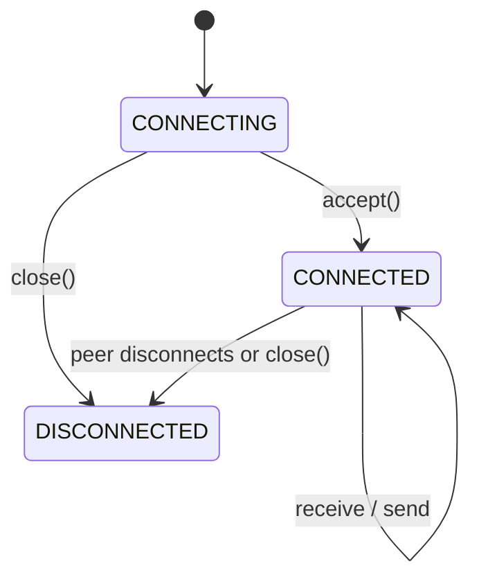

# WebSockets

Lettia exposes native ASGI WebSockets through `WebSocketContext`. The
connection state is explicit:



## Register a handler

```python
from lettia import App, WebSocketContext, WebSocketDisconnect

app = App()


@app.websocket("/ws")
async def echo(ws: WebSocketContext) -> None:
    await ws.accept()

    try:
        while True:
            message = await ws.receive_text()
            await ws.send_text(f"Echo: {message}")
    except WebSocketDisconnect:
        # The peer has already closed the connection.
        return
```

`WebSocketDisconnect` is a normal connection event, not an HTTP error. The
application catches it at the ASGI boundary; handlers can catch it when they
need cleanup logic.

## Context methods

| Method | Behavior |
|---|---|
| `accept(subprotocol=None)` | Accept the handshake and optionally choose a subprotocol |
| `receive_message()` | Receive the raw ASGI WebSocket message |
| `receive_text()` | Receive text, or decode a binary frame as UTF-8 |
| `receive_bytes()` | Receive bytes, or encode a text frame as UTF-8 |
| `receive_json()` | Decode a text message as JSON |
| `send_text(data)` | Send a text frame |
| `send_bytes(data)` | Send a binary frame |
| `send_json(data)` | Serialize and send a JSON text frame |
| `close(code=1000, reason=None)` | Send a close frame and mark the context disconnected |

Calling receive or send before `accept()`, or sending after close, raises
`RuntimeError`. A peer disconnect changes `client_state` to
`WebSocketState.DISCONNECTED`.

## Authentication and state

Inspect handshake headers before accepting when an endpoint requires a token:

```python
@app.websocket("/private")
async def private(ws: WebSocketContext) -> None:
    if ws.headers.get("authorization") != "Bearer expected-token":
        await ws.close(code=1008, reason="Unauthorized")
        return

    await ws.accept()
```

Use `ws.state` for connection-local values. WebSocket handlers do not use the
HTTP response or HTTP middleware chain; keep protocol-specific setup inside the
WebSocket handler. In particular, enforce origin policy, authentication,
authorization, connection lifetime, and message-size policy at the handler or
ASGI-server boundary. `ws.state` is isolated from every HTTP request and from
other WebSocket connections.
